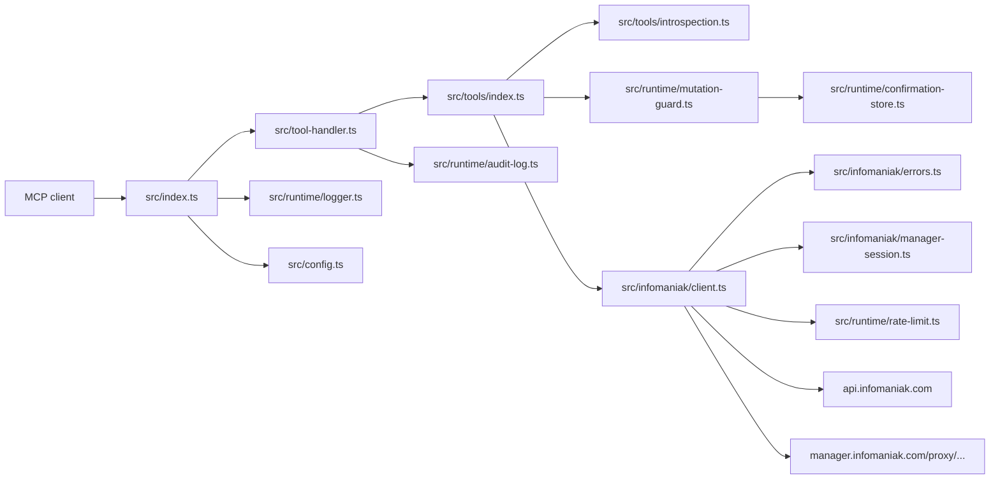
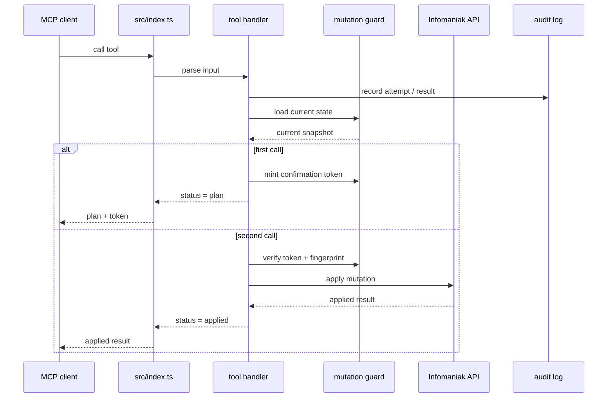

# @henrikogard/infomaniak-admin-mcp

> **Admin tasks for Infomaniak tenant management**

`infomaniak-admin-mcp` is an admin-focused MCP server for
Infomaniak tenant operations. It covers mail security and admin, account
governance, kDrive and domain audits, hosting, DNS, DNSSEC, kChat governance,
Public Cloud, Swiss Backup, Node.js apps, AI usage inventory, persistent audit
logs, and other tenant-level workflows. Writes use a two-phase confirm flow, so
nothing changes until you approve it.

## Table of contents

- [User vs Admin Scope](#user-vs-admin-scope) · [Admin Scope](#admin-scope) · [1.0 Launch Status](#10-launch-status)
- [Services](#services) · [Capability Matrix](#capability-matrix) · [Backend & Protocol Matrix](#backend--protocol-matrix)
- [API Reference](#api-reference) · [Use Cases](#use-cases) · [Quick Start](#quick-start)
- [Environment Variables](#environment-variables) · [Architecture](#architecture) · [All Tools](#all-tools)
- [Security & Privacy](#security--privacy) · [Known Limitations](#known-limitations) · [Disclaimer](#disclaimer)
- [Acknowledgements](#acknowledgements) · [License](#license)

## User vs Admin Scope

This project is for account and tenant administration. End-user workflows stay in
[`infomaniak-mcp`](https://github.com/henrikogaard/infomaniak-mcp). If a task
changes other users, domains, hosting, mailbox security, or shared policy, it
belongs here. kMeet scheduling and user-facing kChat conversation features are
out of scope.

The full boundary list is included below.

## 1.0 Launch Status

`@henrikogard/infomaniak-admin-mcp` is prepared for publication as version `1.1.0`.

The current tree is npm-first: TypeScript strict, Vitest tests, build,
and the package dry-run are the release checks. It has been exercised against a
real Infomaniak account during development, and the remaining API caveats are
documented in the [API Reference](#api-reference) section below.

## Admin Scope

This project should stay focused on account administration. End-user workflows such
as kMeet scheduling or personal kChat usage are out of scope unless they expose
an account-admin control plane, audit surface, or compliance workflow.

### Admin-First Rules

- Read tools may run immediately.
- Write or destructive tools must use a two-phase confirmation token.
- Offboarding writes start with narrow, reversible-adjacent operations where the
  endpoint semantics are clear. Broad app-access revocation should be added per
  product, not guessed from generic access data.
- `infomaniak_tool_catalog` lists admin categories, high-value use cases, and
  each tool's capability metadata.
- `infomaniak_help` and `infomaniak_explain` include capability metadata:
  `scope`, `risk`, and `confirmation_required`.

### Coverage Report

Use `infomaniak_api_coverage_report` to compare the current tool registry with
the live Infomaniak developer portal navigation.

```json
{
  "limit": 25
}
```

The report classifies endpoints as:

- `covered`: already represented by a typed MCP tool.
- `admin_candidate`: useful admin read endpoint not yet wrapped.
- `dangerous_write`: write/delete endpoint that needs a narrow two-phase tool.
- `end_user_out_of_scope`: user-facing surfaces such as kMeet scheduling.
- `unknown`: low-priority or not clearly admin-oriented.

Default source: `https://developer.infomaniak.com/docs/api`.

### Account Access Audit

Use `infomaniak_audit_account_access` for cross-user access posture.

```json
{
  "account_id": 123456,
  "max_users": 50
}
```

It reads account users and each user's app accesses, then flags privileged or
broad access. It does not mutate anything.

### User Offboarding

Start with a read-only plan:

```json
{
  "account_id": 123456,
  "user_id": 7890
}
```

Tool: `infomaniak_plan_user_offboarding`

To cancel pending account invitations for that user, use the two-phase tool:

```json
{
  "account_id": 123456,
  "user_id": 7890
}
```

Tool: `infomaniak_cancel_user_pending_invitations`

The first call returns pending invitation IDs and a `confirmation_token`. Apply
only by calling the same tool again with the same parameters plus the token:

```json
{
  "account_id": 123456,
  "user_id": 7890,
  "confirmation_token": "00000000-0000-0000-0000-000000000000"
}
```

The apply phase refetches invitations and deletes only invitations that still
match the confirmed pending state.

### Account Governance

Use these read tools to inspect account posture before making changes:

- `infomaniak_list_account_users`
- `infomaniak_get_user_app_accesses`
- `infomaniak_plan_user_offboarding`
- `infomaniak_audit_account_access`

Use these write tools for admin-controlled account governance:

- `infomaniak_create_account_invitation`
- `infomaniak_update_account_invitation`
- `infomaniak_delete_account_invitation`
- `infomaniak_create_account_team`
- `infomaniak_update_account_team`
- `infomaniak_delete_account_team`
- `infomaniak_add_account_team_users`
- `infomaniak_remove_account_team_users`
- `infomaniak_create_account_tag`
- `infomaniak_update_account_tag`
- `infomaniak_delete_account_tag`

All account-governance writes use two-phase confirmation and refetch the
current account, invitation, team, or tag state before applying.

### Invitation-Based Product Access

Use `infomaniak_get_account_invitation_access` to inspect the current access
snapshot on a pending account invitation before changing anything.

Use `infomaniak_manage_account_invitation_access` to grant, update, invite, or
revoke kSuite, drive, mailbox, or kChat access on that invitation.

```json
{
  "account_id": 123456,
  "invitation_id": 77,
  "target": "drive",
  "action": "create",
  "drive_id": 44311,
  "payload": { "role": "manager" }
}
```

The write tool always refetches the invitation snapshot before planning and
before applying. It stays admin-first: no end-user chat workflow, no consumer
sharing shortcut, and no silent mutation.

### kDrive Admin Audit

Use `infomaniak_audit_kdrive_admin` for a read-only kDrive posture check.

```json
{
  "drive_id": 44311,
  "storage_warning_ratio": 0.9
}
```

It checks product state, storage usage, drive users, external users, share links,
settings, and trash count. It deliberately avoids end-user file operations.

Trash administration writes are available as narrow confirmed tools:

- `infomaniak_empty_drive_trash`
- `infomaniak_restore_drive_trash_item`
- `infomaniak_remove_drive_trash_item`
- `infomaniak_update_drive_trash_settings`

All kDrive trash writes use two-phase confirmation and current-state guards.

kDrive share-link administration is available for exposure cleanup:

- `infomaniak_list_drive_share_links`
- `infomaniak_get_drive_share_link`
- `infomaniak_create_drive_share_link`
- `infomaniak_update_drive_share_link`
- `infomaniak_remove_drive_share_link`
- `infomaniak_invite_drive_share_link`

Share-link writes are guarded by the current share-link state for the target
file or folder.

kDrive file-permission administration is also available as narrow confirmed
tools:

- `infomaniak_list_drive_file_access_users`
- `infomaniak_list_drive_file_access_teams`
- `infomaniak_list_drive_file_access_invitations`
- `infomaniak_create_drive_file_access_user`
- `infomaniak_update_drive_file_access_user`
- `infomaniak_remove_drive_file_access_user`
- `infomaniak_create_drive_file_access_team`
- `infomaniak_update_drive_file_access_team`
- `infomaniak_remove_drive_file_access_team`
- `infomaniak_create_drive_file_access_invitation`

All file-access writes use two-phase confirmation and refetch the current
access list or invitation list before applying.

Use `infomaniak_get_drive_statistics` for read-only kDrive storage, activity,
shared-file, user, and share-link statistics, including supported export
endpoints.

### kDrive Settings

Use `infomaniak_get_drive_settings` to inspect the current AI, link, office,
and preferences policy snapshot for a drive.

Use `infomaniak_manage_drive_settings` to update one of those policy surfaces
with a two-phase confirmation token.

```json
{
  "drive_id": 44311,
  "action": "update_link",
  "settings": { "password_required": true, "default_expire_days": 7 }
}
```

These writes are admin policy changes, not file-level collaboration actions.
They refetch the current settings snapshot before planning and before apply.

kDrive user administration writes are also available as narrow confirmed tools:

- `infomaniak_create_drive_user`
- `infomaniak_update_drive_user`
- `infomaniak_delete_drive_user`
- `infomaniak_lock_drive_user`
- `infomaniak_unlock_drive_user`
- `infomaniak_set_drive_user_manager`

Create operations are guarded by the current drive user list. User updates,
deletes, locks, unlocks, and manager-right changes are guarded by the current
user snapshot.

### Domain and DNS Admin Audit

Use `infomaniak_audit_domain_dns_admin` for a single-zone posture check.

```json
{
  "domain": "example.com",
  "zone": "example.com",
  "low_ttl_threshold": 300
}
```

It reads DNS records and DNSSEC status, then flags missing MX/SPF/DMARC,
disabled DNSSEC, wildcard records, and very low TTLs.

### Mail Security

The first mail security module is mailbox-admin focused:

- `infomaniak_get_mailbox_security`
- `infomaniak_block_sender`
- `infomaniak_unblock_sender`
- `infomaniak_authorize_sender`
- `infomaniak_unauthorize_sender`
- `infomaniak_list_mailbox_filters`
- `infomaniak_list_mailbox_filter_scripts`
- `infomaniak_set_mailbox_spam_policy`
- `infomaniak_update_mailbox_folders`
- `infomaniak_purge_spam_folder`
- `infomaniak_audit_mailbox_security`
- `infomaniak_harden_mailbox_security`

All mailbox security writes use two-phase confirmation and stale-state checks.

### Mail Administration

These are admin-side mailbox and routing controls:

- `infomaniak_manage_mailbox_aliases`
- `infomaniak_manage_mailbox_forwarding`
- `infomaniak_manage_mailbox_auto_reply`
- `infomaniak_manage_service_redirections`
- `infomaniak_rotate_mail_dkim`

All mail-administration writes use two-phase confirmation and refetch the
current mailbox or mail-hosting state before applying.

### Mail Signatures And Templates

- `infomaniak_get_mail_signatures`
- `infomaniak_manage_mail_signatures`

These tools cover mailbox and service signature inventories plus template
creation, updates, deletes, and default selection. Writes use the same
  two-phase confirmation and current-state guard as the rest of the project.

### Webmail Access

- `infomaniak_get_mail_webmail_access`
- `infomaniak_manage_mail_webmail_access`

These tools are for administrator-controlled mailbox webmail access review and
revocation. They are not for personal chat or end-user productivity workflows.

### Device And Session Cleanup

- `infomaniak_get_mail_device_access`
- `infomaniak_manage_mail_device_access`

These tools expose mailbox device/session inventory and confirmed cleanup of
stale or suspicious access.

### Newsletter Groups And Subscribers

- `infomaniak_get_newsletter_admin`
- `infomaniak_manage_newsletter_admin`

These tools are admin governance for newsletter lists, groups, assignment, and
subscriber lifecycle actions. They stay on the list-management side of the API
and avoid end-user broadcast composition tooling.

### kChat Governance

The kChat surface in this project is intentionally admin-only:

- `infomaniak_list_kchat_channels`
- `infomaniak_list_kchat_team_channels`
- `infomaniak_get_kchat_channel`
- `infomaniak_list_kchat_channel_members`
- `infomaniak_get_kchat_channel_moderation`
- `infomaniak_list_kchat_groups`
- `infomaniak_list_kchat_bots`
- `infomaniak_get_kchat_bot`
- `infomaniak_list_kchat_commands`
- `infomaniak_get_kchat_command`
- `infomaniak_list_kchat_roles`
- `infomaniak_manage_kchat_channel`
- `infomaniak_manage_kchat_channel_members`
- `infomaniak_manage_kchat_bot`
- `infomaniak_manage_kchat_command`

Use these for channel inventory, moderation review, group-linked permission
audit, bot lifecycle, slash-command maintenance, and member-role management.
Do not use them for personal chat, DMs, reactions, or kMeet scheduling.

### Live Smoke Tests

Live tests are disabled by default. Enable them only against a test-safe account:

```bash
export INFOMANIAK_LIVE_TESTS=1
export INFOMANIAK_API_TOKEN=...
export INFOMANIAK_TEST_ACCOUNT_ID=123456
export INFOMANIAK_TEST_USER_ID=7890
export INFOMANIAK_TEST_MAIL_HOSTING_ID=456789
export INFOMANIAK_TEST_MAILBOX=admin@example.com
npm test -- test/live/admin-smoke.live.test.ts
```

The live harness only performs read operations.

### Audit Logs

Persistent audit logging is enabled by default.

Default path:

```text
./logs/infomaniak-mcp-audit.jsonl
```

Each line is JSON and records the tool name, timestamp, phase, risk, whether a
confirmation token was present, sanitized input, a sanitized result summary, and
failures. Secrets are redacted, including API tokens, cookies, passwords,
private keys, certificates, and confirmation tokens.

Read the newest entries from inside MCP:

```json
{
  "limit": 25
}
```

Tool: `infomaniak_audit_log_tail`

Find applied writes:

```json
{
  "phase": "applied",
  "limit": 50
}
```

Tool: `infomaniak_audit_log_search`

Find destructive attempts or failures:

```json
{
  "risk": "destructive",
  "limit": 100
}
```

```json
{
  "phase": "failed",
  "limit": 100
}
```

Configure with:

```bash
export INFOMANIAK_AUDIT_LOG_ENABLED=true
export INFOMANIAK_AUDIT_LOG_INCLUDE_READS=true
export INFOMANIAK_AUDIT_LOG_PATH=./logs/infomaniak-mcp-audit.jsonl
```

## Services

| Service | Protocol | Description |
|---|---|---|
| Hosting & SSL | Infomaniak REST plus manager-private proxy | Sites, certificates, databases, FTP/SSH users, and Node.js apps |
| DNS / DNSSEC | Infomaniak REST | DNS records, DNSSEC checks, and record changes |
| Mail admin & security | Infomaniak Mail API | Mailboxes, sender control, routing, signatures, webmail access, device cleanup, and newsletters |
| Account governance | Infomaniak REST | Users, invitations, teams, tags, access audits, and offboarding |
| kDrive governance | Infomaniak REST plus manager-private proxy | Share links, file permissions, drive settings, users, trash, and statistics |
| kChat governance | Infomaniak REST | Channels, members, moderation, bots, commands, and roles |
| Identity & audit | Infomaniak REST plus local JSONL | Profile, security posture, session history, and audit trails |
| Cloud and utility tools | Infomaniak REST | VPS, short URLs, Swiss Backup, AI inventory, and workflow helpers |
| Escape hatch | MCP direct API call | Raw API access when a typed tool is not available |

## Capability Matrix

| Surface | Read | Write | Notes |
|---|---|---|---|
| Hosting & SSL | Yes | Yes | Two-phase writes for sites, certificates, databases, and hosting users. |
| DNS / DNSSEC | Yes | Yes | Two-phase record and DNSSEC changes. |
| Mail admin & security | Yes | Yes | Sender blocks, allow lists, routing, signatures, webmail access, device cleanup, and newsletters. |
| Account governance | Yes | Yes | Invitations, teams, tags, access audits, and offboarding. |
| kDrive governance | Yes | Yes | Share links, permissions, settings, users, trash, and statistics. |
| kChat governance | Yes | Yes | Channels, members, moderation, bots, commands, and roles. |
| Identity & audit | Yes | No | Profile, security posture, session history, and audit log reads. |
| Cloud and utility tools | Yes | No | VPS, short URLs, Swiss Backup, and AI inventory. |
| Workflow tools / help | Yes | No | Planning helpers and self-description. |
| Escape hatch | Yes | Yes | Raw API calls, with confirmation on mutating methods. |

## Backend & Protocol Matrix

| Area | Backend / protocol | Host | Auth | Used for |
|---|---|---|---|---|
| Hosting & SSL | Infomaniak REST plus manager-private proxy | `api.infomaniak.com`, `manager.infomaniak.com/proxy/...` | Bearer `INFOMANIAK_API_TOKEN` plus `SASESSION` / `MANAGER-XSRF-TOKEN` | Sites, certificates, databases, FTP/SSH, and Node.js apps |
| DNS / domains | Infomaniak REST | `api.infomaniak.com` | Bearer token | Records, DNSSEC, domain reads, and audits |
| Mail admin | Infomaniak Mail API | `mail.infomaniak.com/api` | Bearer token | Mailbox security, routing, signatures, webmail access, device cleanup, and newsletters |
| Account / org | Infomaniak REST | `api.infomaniak.com` | Bearer token | Users, invitations, teams, tags, and access audits |
| kDrive | Infomaniak REST plus manager-private proxy | `api.infomaniak.com`, `manager.infomaniak.com/proxy/...` | Bearer token plus browser session or manual cookies | Share links, permissions, settings, users, trash, and statistics |
| kChat | Infomaniak REST | `*.kchat.infomaniak.com` | Bearer token | Governance tools for teams, channels, members, bots, and commands |
| Utility surfaces | Infomaniak REST | `api.infomaniak.com` | Bearer token | VPS, short URLs, Swiss Backup, and AI inventory |
| Audit log | local JSONL | `./logs/infomaniak-mcp-audit.jsonl` | local filesystem | Append-only audit trail of tool activity |

## API Reference

This document is the current integration reference for `infomaniak-admin-mcp`.
It replaces the older discovery notebook with a cleaner, maintainable view of
how this project uses Infomaniak's documented API and the manager-backed routes
that are needed for admin work.

### Sources of truth

- Infomaniak Developer Portal: [https://developer.infomaniak.com/docs/api](https://developer.infomaniak.com/docs/api)
- Live tool discovery and coverage helpers: `infomaniak_tool_catalog`, `infomaniak_help`, `infomaniak_explain`, and `infomaniak_api_coverage_report`

When the docs and the live API differ, this project treats the live API response
as the implementation source of truth and keeps the docs aligned with the
behavior that is actually shipping.

### Authentication model

Infomaniak exposes two auth surfaces that matter for this project:

- `api.infomaniak.com` uses a Bearer token from the user's account.
- `manager.infomaniak.com/proxy/...` uses the user's own manager session
  (`SASESSION` + `X-XSRF-TOKEN`).

The manager-backed routes are used only for admin workflows that the public API
does not cover safely. No credentials are persisted by the server; it reads the
user's local browser session or manual environment variables when needed.

### What this project relies on

| Surface | Typical auth | Notes |
|---|---|---|
| Account, organization, product inventory | Bearer token | Read-mostly data used for audits and discovery. |
| Mail, DNS, domains, drive, backups, URL shortener, AI | Bearer token | Mostly documented public API coverage. |
| Site, database, and application admin writes | Manager session | Confirmed writes routed through the manager-backed API. |
| Node.js hosting actions | Manager session | App lifecycle, logs, thumbnails, and job history. |
| kChat governance | Manager session | Admin/team/channel control only; no personal chat workflows. |

### Operational notes

- The server keeps a shared 60 req/min throttle across both API clients.
- Destructive operations always use a two-phase confirm/apply flow.
- Tool execution is written to an append-only JSONL audit log when enabled.
- The audit log stores the tool name, phase, confirmation state, and a redacted
  summary of the request and response.
- `infomaniak_audit_log_tail` and `infomaniak_audit_log_search` are the best
  way to inspect what the MCP has been asked to do.
- New kDrive activity/report tools support repeated array query parameters for
  actions, files, and users. API payloads for evolving Public Cloud, account,
  and backup resources remain pass-through objects where Infomaniak's schema is
  product- or plan-dependent.

### Practical caveats this project keeps documented

- Site creation expects `force_fqdn: true` and a directory under `/sites/`.
- Hosting user creation uses `connection_type: ftp` or `connection_type: ssh`.
- Database password rotation stays intentionally outside the typed write tools;
  the safe path is still direct MariaDB `ALTER USER` over SSH when required.
- Node.js hostings are managed as one app per hosting and use the vhost route
  identifier in action URLs.
- kChat remains admin-only. Personal conversations, reactions, and kMeet are
  out of scope for this project.

### Keeping docs current

When you add or change a tool:

1. Update the tool's source and tests.
2. Update the README's tool list or use-case section if it affects users.
3. Update this README if there is a new integration caveat or manager
   route worth keeping visible.

This document is intentionally concise. It should help contributors understand
the integration model without turning the repository into a discovery log.

### MCP Tool Discovery

AI agents do not infer the tool list from this README. The live surface comes
from MCP `tools/list` after the client starts the server.

`infomaniak_help` is a read-only self-description tool. Ask your MCP client to
"ask the Infomaniak MCP what tools it has" or call `infomaniak_help` with
`service: "mail"` to get the current tools grouped by area, along with risk
labels, argument names, and confirmation hints.

## Use Cases

These are some of the workflows it handles well:

### Block senders and spam campaigns

Tell Claude:

```text
Block spam@example.net from info@example.com.
```

Claude can call `infomaniak_block_sender`, which reads the mailbox's current
`authorized_senders` and `blocked_senders`, returns a diff, and only applies the
block after you confirm with the returned token. If the sender was previously
authorized, the tool removes it from the trusted list while adding it to the
blocked list. The matching unblock and allow-list tools are
`infomaniak_unblock_sender`, `infomaniak_authorize_sender`, and
`infomaniak_unauthorize_sender`.

### Harden mailbox security

Ask:

```text
Audit and harden info@example.com against spam, but show me exactly what would change first.
```

Claude can use `infomaniak_get_mailbox_security`,
`infomaniak_audit_mailbox_security`, and `infomaniak_harden_mailbox_security` to
review spam movement, smart filtering, trusted senders, blocked senders, notes,
and mailbox filter state. Writes use the same two-phase confirmation pattern.

### Govern account invitations, teams, and tags

Ask:

```text
Create an invitation for contractor@example.com, add them to the Security team, and tag the account for review.
```

Claude can use `infomaniak_create_account_invitation`,
`infomaniak_update_account_invitation`,
`infomaniak_delete_account_invitation`, `infomaniak_create_account_team`,
`infomaniak_update_account_team`, `infomaniak_delete_account_team`,
`infomaniak_add_account_team_users`, `infomaniak_remove_account_team_users`,
`infomaniak_create_account_tag`, `infomaniak_update_account_tag`, and
`infomaniak_delete_account_tag`. Each write tool plans first and applies only
after confirmation with a fresh current-state check.

### Grant product access through an invitation

Ask:

```text
Show me the current invitation snapshot, then grant drive and mailbox access on invitation 77.
```

Claude can use `infomaniak_get_account_invitation_access` to inspect the current
invitation, then `infomaniak_manage_account_invitation_access` to create,
update, invite, or revoke kSuite, drive, mailbox, or kChat access with a
fresh snapshot guard and confirmation token.

### Reconfigure mailbox routing

Ask:

```text
Replace the aliases and forwarding on info@example.com, then set an auto-reply and rotate DKIM.
```

Claude can use `infomaniak_manage_mailbox_aliases`,
`infomaniak_manage_mailbox_forwarding`,
`infomaniak_manage_mailbox_auto_reply`,
`infomaniak_manage_service_redirections`, and `infomaniak_rotate_mail_dkim` to
adjust mailbox-level and service-level mail routing. These are also two-phase
writes with current-state guards.

### Manage mail signatures and templates

Ask:

```text
List mailbox signatures and then update the template before I roll it out.
```

Claude can use `infomaniak_get_mail_signatures` to inspect mailbox or service
signature templates, then `infomaniak_manage_mail_signatures` to create,
update, delete, or apply defaults with confirmation.

### Review webmail access

Ask:

```text
Show me who can use webmail on this mailbox, then revoke the stale account.
```

Claude can use `infomaniak_get_mail_webmail_access` to review current user and
team access, then `infomaniak_manage_mail_webmail_access` to add, update, or
remove access with a fresh state check.

### Clean up mail device sessions

Ask:

```text
List the mailbox device sessions and remove the suspicious one.
```

Claude can use `infomaniak_get_mail_device_access` to inspect device/session
inventory, then `infomaniak_manage_mail_device_access` to delete a device or
clear a user's mailbox device access with confirmation.

### Manage newsletter groups and subscribers

Ask:

```text
List newsletter groups and subscribers for example.com, then clean up the stale ones.
```

Claude can use `infomaniak_get_newsletter_admin` for read-only inventory and
`infomaniak_manage_newsletter_admin` for confirmed create, update, delete,
assign, unassign, and forget operations.

### Offboard users safely

Ask:

```text
Prepare offboarding for user 7890 on account 123456.
```

Claude can use `infomaniak_plan_user_offboarding` and
`infomaniak_audit_account_access` to show app access and pending invitations.
For pending invitations, `infomaniak_cancel_user_pending_invitations` cancels
only after a confirmation token and a fresh state check.

### Audit admin posture

Useful prompts:

```text
Audit account access and highlight privileged users.
Audit kDrive 44311 for risky share links and external users.
Audit example.com for DNSSEC, MX, SPF, DMARC, wildcard records, and low TTLs.
```

These map to `infomaniak_audit_account_access`,
`infomaniak_audit_kdrive_admin`, and `infomaniak_audit_domain_dns_admin`.

### Clean up kDrive share links

Ask:

```text
List risky share links on kDrive 44311 and remove anything public with no expiry.
Tighten the share link on file 888 so it has a password and expiry.
```

Claude can use `infomaniak_list_drive_share_links` and
`infomaniak_get_drive_share_link` for review, then
`infomaniak_update_drive_share_link`, `infomaniak_remove_drive_share_link`, or
`infomaniak_invite_drive_share_link`. Writes are two-phase and guarded by the
current share-link state.

### Manage kDrive file permissions safely

Ask:

```text
Review who can access file 888 on kDrive 44311, then grant team 33 read access.
Invite external@example.com to the same file, but show me the plan first.
```

Claude can use `infomaniak_list_drive_file_access_users`,
`infomaniak_list_drive_file_access_teams`, and
`infomaniak_list_drive_file_access_invitations` to review current file access,
then `infomaniak_create_drive_file_access_user`,
`infomaniak_update_drive_file_access_user`,
`infomaniak_remove_drive_file_access_user`,
`infomaniak_create_drive_file_access_team`,
`infomaniak_update_drive_file_access_team`,
`infomaniak_remove_drive_file_access_team`, or
`infomaniak_create_drive_file_access_invitation`. Every write uses two-phase
confirmation and refetches the current access list before applying.

### Review kDrive activity

Ask:

```text
Show me kDrive 44311 storage, user activity, shared-file activity, and share-link activity this month.
Export share-link activity for kDrive 44311.
```

Claude can call `infomaniak_get_drive_statistics` for storage size charts and
exports, activity charts and exports, user activity, shared-file activity, and
share-link activity.

### Tune kDrive settings

Ask:

```text
Read the current kDrive settings snapshot, then tighten AI, link, office, and preferences policy.
```

Claude can use `infomaniak_get_drive_settings` to inspect the current policy
snapshot, then `infomaniak_manage_drive_settings` to update the AI, share-link,
office, or preferences settings with a fresh state check and confirmation.

### Manage kDrive users safely

Ask:

```text
Add new@example.com to kDrive 44311 as a user, but show me the plan before applying.
Lock user 7890 on kDrive 44311 until we finish the offboarding review.
```

Claude can use `infomaniak_list_drive_users` to review current access, then
`infomaniak_create_drive_user`, `infomaniak_update_drive_user`,
`infomaniak_lock_drive_user`, `infomaniak_unlock_drive_user`,
`infomaniak_set_drive_user_manager`, or `infomaniak_delete_drive_user`. Every
write reads the current user/list state first and requires the returned
confirmation token before it mutates kDrive access.

### Review what the MCP did

Every MCP tool call is written to an append-only JSONL audit log by default.
Writes include explicit `plan`, `apply_attempt`, `applied`, and `failed` phases;
read-only successes can be included or disabled. Secrets are redacted, including
API tokens, cookies, passwords, private keys, certificates, and confirmation
tokens.

Ask:

```text
Show me every applied change from today.
Show me failed or destructive MCP actions.
Tail the last 25 audit log entries.
```

Claude can use `infomaniak_audit_log_tail` and
`infomaniak_audit_log_search`. The default log path is
`./logs/infomaniak-mcp-audit.jsonl`.

## Architecture

### 1. Runtime at a glance



The diagram is conceptual rather than a literal import graph. It shows the
main runtime pieces and the helpers they rely on.

The domain modules under `src/tools/*.ts` sit behind that graph. They are thin
wrappers around shared helpers and are grouped by operational area: account,
mail, drive, DNS, hosting, kChat governance, identity, audit, and workflow.

### 2. Current module map

| Layer | Main files | Responsibility |
|---|---|---|
| Entry point | `src/index.ts` | Starts stdio or streamable HTTP and wires MCP request handlers. |
| Tool handler | `src/tool-handler.ts` | Converts Zod schemas to MCP JSON Schema, dispatches tool calls, and returns structured output. |
| Config | `src/config.ts` | Validates environment variables once and caches the result. |
| Infomaniak clients | `src/infomaniak/client.ts`, `src/infomaniak/errors.ts`, `src/infomaniak/manager-session.ts` | Public API calls, manager-session calls, typed errors, and cookie-backed manager auth. |
| Runtime | `src/runtime/rate-limit.ts`, `src/runtime/logger.ts` | Shared rate limiting and stderr logging with secret redaction. |
| Tool registry | `src/tools/index.ts` | Central export list for every exposed tool, grouped by admin domain. |
| Self-documentation | `src/tools/introspection.ts` | `infomaniak_help`, `infomaniak_tool_catalog`, `infomaniak_explain`, and coverage helpers. |
| Mutation guard | `src/runtime/confirmation-store.ts`, `src/runtime/mutation-guard.ts` | Single-use plan/apply tokens with fingerprinted stale-state checks. |
| Audit trail | `src/runtime/audit-log.ts`, `src/tools/audit-log.ts` | Append-only JSONL log plus read/search tools over that log. |
| Shared schemas | `src/schemas/infomaniak.ts` | Zod models for Infomaniak requests and responses. |

### 3. Two Infomaniak APIs, two auth schemes

Infomaniak exposes two different HTTP surfaces, and the MCP chooses between
them deliberately.

- `api.infomaniak.com` uses a Bearer token and covers the documented public
  API plus some undocumented sub-routes that still behave like public routes.
- `manager.infomaniak.com/proxy/...` uses the user's own manager session:
  `SASESSION` plus `X-XSRF-TOKEN`.
- The manager-private API is used for writes that the public surface accepts
  but does not actually process, especially web-hosting mutations.
- OAuth scopes do not unlock the same manager-only product actions, so the MCP
  uses the same authenticated browser session the user already has locally.

### 4. Confirmed writes



Every confirmed write follows the same shape:

1. load the current state
2. build a plan from the current state and the request parameters
3. mint a single-use confirmation token
4. on the second call, re-load the current state and verify the token plus
   fingerprint
5. apply the mutation only if the parameters and state still match

The guard lives in `src/runtime/mutation-guard.ts`, while token minting and
consumption live in `src/runtime/confirmation-store.ts`.

### 5. Logging and auditability

The server writes two different kinds of logs.

- Operational logs go to stderr through `pino`, because stdout is reserved for
  JSON-RPC framing.
- Tool activity can also be written to a durable append-only JSONL audit log.
- Audit phases currently include `read`, `plan`, `apply_attempt`, `applied`,
  `failed`, and `completed`.
- The audit trail is searchable through the `infomaniak_audit_log_tail` and
  `infomaniak_audit_log_search` tools.
- Sensitive data is redacted before it reaches the durable log.

That makes it possible to answer questions like "what did the MCP try to do?"
without scraping process output.

### 6. Transport

The default transport is stdio, which is the standard MCP integration path for
Claude Desktop, Claude Code, and the local Inspector.

The server also supports streamable HTTP for local/dev proxy scenarios.
Relevant environment variables:

- `MCP_TRANSPORT=stdio|http|streamable-http`
- `MCP_HTTP_HOST`
- `MCP_HTTP_PORT`
- `MCP_HTTP_PATH`
- `MCP_HTTP_STATELESS`

The transport is selected at startup; no code changes are needed to switch.

### 7. Self-documentation tools

The MCP is intentionally self-describing.

- `infomaniak_help` turns free-form intent into likely tools.
- `infomaniak_tool_catalog` lets an agent browse the registry by category,
  scope, and risk.
- `infomaniak_explain` dumps the full schema of a single tool.
- `infomaniak_api_coverage_report` compares the current registry with the live
  Infomaniak docs inventory.

That means an agent can ask the MCP what it does instead of relying on stale
external notes.


### Intentional exclusions

This MCP is admin-first by design.

- no browser automation layer
- no persisted secrets beyond the user-controlled environment and browser
  session
- no end-user kMeet scheduling
- no personal kChat conversation tooling
- no cross-tenant aggregation by default

The project stays useful by staying narrow: strong admin actions, always with
an explicit safety trail.

## Environment Variables

Set credentials in your MCP client's `env` block, your shell, or the process
manager that starts the server. Do not commit real tokens or manager cookies.

Minimal local shell setup:

```bash
export INFOMANIAK_API_TOKEN="paste-your-token-here"
export INFOMANIAK_AUTH_MODE="auto"
npx -y @henrikogard/infomaniak-admin-mcp
```

Manual manager-session fallback:

```bash
export INFOMANIAK_AUTH_MODE="manual"
export INFOMANIAK_SASESSION="paste-sasession-cookie"
export INFOMANIAK_XSRF_TOKEN="paste-manager-xsrf-token"
```

Optional operational settings:

```bash
export LOG_LEVEL="info"
export CONFIRMATION_TTL_SECONDS="60"
export RATE_LIMIT_PER_MINUTE="60"
export INFOMANIAK_AUDIT_LOG_ENABLED="true"
export INFOMANIAK_AUDIT_LOG_INCLUDE_READS="true"
export INFOMANIAK_AUDIT_LOG_PATH="./logs/infomaniak-mcp-audit.jsonl"
```

| Variable | Required | Default | Purpose |
|---|---|---|---|
| `INFOMANIAK_API_TOKEN` | Yes | - | Bearer token for `api.infomaniak.com` |
| `INFOMANIAK_AUTH_MODE` | No | `auto` | `auto` reads Chrome cookies, `manual` uses `INFOMANIAK_SASESSION` and `INFOMANIAK_XSRF_TOKEN`, `disabled` skips manager-private endpoints |
| `INFOMANIAK_SASESSION` | No | - | Manager session cookie for manual mode |
| `INFOMANIAK_XSRF_TOKEN` | No | - | Manager XSRF cookie for manual mode |
| `LOG_LEVEL` | No | `info` | Pino log level |
| `CONFIRMATION_TTL_SECONDS` | No | `60` | TTL for destructive-operation confirmation tokens |
| `RATE_LIMIT_PER_MINUTE` | No | `60` | Request rate limit, capped at the Infomaniak hard limit |
| `INFOMANIAK_AUDIT_LOG_ENABLED` | No | `true` | Enable append-only audit logging |
| `INFOMANIAK_AUDIT_LOG_INCLUDE_READS` | No | `true` | Include successful reads in the audit log |
| `INFOMANIAK_AUDIT_LOG_PATH` | No | `./logs/infomaniak-mcp-audit.jsonl` | JSONL audit log path |

## Quick Start

### 1. Install

```bash
npm install @henrikogard/infomaniak-admin-mcp
npx -y @henrikogard/infomaniak-admin-mcp
```

### 2. Build from source

```bash
git clone https://github.com/henrikogaard/infomaniak-admin-mcp.git
cd infomaniak-admin-mcp
npm ci
npm run build
npm start
```

The built server entry point is `./dist/index.js`.

### 3. Get your credentials

Two distinct credentials are needed because Infomaniak exposes both public and
manager-private surfaces:

| API | Auth | Purpose |
|---|---|---|
| `api.infomaniak.com/{1,2}/...` | **Bearer token** | Read-mostly admin data, including profile, products, mail, drive, DNS, domains, and billing |
| `manager.infomaniak.com/proxy/...` | **SASESSION cookie + CSRF token** | Writes on manager-private admin surfaces, including web hosting and Node.js apps |

#### 1. Bearer token (required)

1. Sign in to your Infomaniak account.
2. Go to [manager.infomaniak.com/v3/ng/profile/user/token/list](https://manager.infomaniak.com/v3/ng/profile/user/token/list).
3. Click **"Create a token"**, give it a long lifetime, copy the value.
4. Set it in `INFOMANIAK_API_TOKEN`.

#### 2. Manager session (auto, recommended)

The manager-private API does not accept Bearer tokens or OAuth. Instead, the MCP
reads the `SASESSION` and `MANAGER-XSRF-TOKEN` cookies that your local Chrome
already has when you are logged into [manager.infomaniak.com](https://manager.infomaniak.com).

With `INFOMANIAK_AUTH_MODE=auto` (the default), the MCP reads these cookies on
demand using [`chrome-cookies-secure`](https://www.npmjs.com/package/chrome-cookies-secure).
Nothing is written to disk; cookies live in memory for the duration of one
operation.

When the session expires, reload [manager.infomaniak.com](https://manager.infomaniak.com)
in Chrome and the MCP will pick up the fresh cookies on the next call.

#### 3. Manager session (manual fallback)

For headless environments or troubleshooting:

```env
INFOMANIAK_AUTH_MODE=manual
INFOMANIAK_SASESSION=...
INFOMANIAK_XSRF_TOKEN=...
```

To copy them: open Chrome DevTools on [manager.infomaniak.com](https://manager.infomaniak.com),
Application → Cookies, copy `SASESSION` and `MANAGER-XSRF-TOKEN` (URL-encoded,
paste as-is, the MCP decodes).

### 4. Configure your AI client

#### Configure Claude Desktop

Add to `~/Library/Application Support/Claude/claude_desktop_config.json` (macOS) or `%AppData%\Claude\claude_desktop_config.json` (Windows):

```json
{
  "mcpServers": {
    "infomaniak-admin": {
      "command": "npx",
      "args": ["-y", "@henrikogard/infomaniak-admin-mcp"],
      "env": {
        "INFOMANIAK_API_TOKEN": "paste-your-token-here",
        "INFOMANIAK_AUTH_MODE": "auto"
      }
    }
  }
}
```

Restart Claude Desktop to pick up the change.

#### Configure Claude Code

```bash
claude mcp add infomaniak \
  -e INFOMANIAK_API_TOKEN=paste-your-token-here \
  -e INFOMANIAK_AUTH_MODE=auto \
  -- npx -y @henrikogard/infomaniak-admin-mcp
```

### 5. Verify the server

```bash
npm run build
npm run verify:mcp
npm run smoke:readonly
```

`npm run verify:mcp` starts the built server, calls `tools/list`,
`prompts/list`, and `resources/templates/list`, and checks that the help tool
and temp-file resource template are advertised. `npm run smoke:readonly` adds a
small read-only sanity pass.

## All Tools

221 tools across the admin surface. Use `infomaniak_tool_catalog` to browse what the MCP can do by category/risk, `infomaniak_help` to fuzzy-search by intent, or `infomaniak_explain` to dump a tool's full JSON schema. Admin-focused examples and scope boundaries are included in [Admin Scope](#admin-scope).

### Introspection (start here)
| Tool | Annotation | Purpose |
|---|---|---|
| `infomaniak_overview` | read-only | Summary of organizations + products. Best first call. |
| `infomaniak_tool_catalog` | read-only | Browse the MCP toolbox by admin category, risk, capability, and high-value use cases. Best answer to "what can this MCP do for me?" |
| `infomaniak_help` | read-only | Suggest tools matching a free-form intent ("create site", "list mailboxes"…). |
| `infomaniak_explain` | read-only | Returns the full definition (description + schemas) of a specific tool. |
| `infomaniak_audit_account` | read-only | Scan an organization for expirations / locked products / ongoing ops. |
| `infomaniak_history` | read-only | List destructive actions taken in this session. |
| `infomaniak_undo` | **destructive** | Reverse a session action when reversible (two-phase commit). |

### Organizations & products
| Tool | Annotation | Purpose |
|---|---|---|
| `infomaniak_list_organizations` | read-only | Accounts you have technical access to. |
| `infomaniak_list_hostings` | read-only | Web hostings (classic + Node.js) for one organization. |
| `infomaniak_list_domains` | read-only | Domains for one organization, with creation + expiration dates. |
| `infomaniak_get_domain` | read-only | Detail of one domain (DNS managed?, DNSSEC, errors). |

### Web hosting sites
| Tool | Annotation | Purpose |
|---|---|---|
| `infomaniak_find_site` | read-only | **Domain-first lookup.** Resolves a public domain (e.g. `broz.be`) to `{account_id, hosting_id, hosting_label, site_id, full site object}`. Use this BEFORE any tool that needs `hosting_id + site_id`. Replaces iterating every hosting's `list_sites` (46+ API calls on a real fleet). |
| `infomaniak_list_sites` | read-only | Sites on a given web hosting (with applications). |
| `infomaniak_create_site` | **destructive** | Two-phase: returns a plan + token, second call with token actually creates. |
| `infomaniak_delete_site` | **destructive** | Two-phase delete (full preview of the site to be removed). |

### SSL certificates
| Tool | Annotation | Purpose |
|---|---|---|
| `infomaniak_get_certificate` | read-only | Current cert status (`updating`/`ok`/`error`), issuer, expiry, ACME identifier errors. |
| `infomaniak_request_certificate` | **destructive** | Two-phase. Issue or renew a cert. Three `type` values: `free` (Let's Encrypt), `paid` (Sectigo, requires `certificate_id`), `custom` (BYO PEM, requires `certificate` + `private_key`). |
| `infomaniak_delete_certificate` | **destructive** | Two-phase. Remove the cert from a site. Undo via `request_certificate` with `type: "free"`. |

### Databases
| Tool | Annotation | Purpose |
|---|---|---|
| `infomaniak_list_databases` | read-only | MariaDB databases attached to a hosting (with disk usage). |
| `infomaniak_get_database` | read-only | Detail of one database. |
| `infomaniak_create_database` | **destructive** | Two-phase create. |
| `infomaniak_delete_database` | **destructive** | Two-phase delete (plan shows disk usage + linked app). |
| `infomaniak_list_database_users` | read-only | MariaDB-level user accounts attached to a hosting (`applications`, `permissions`, phpMyAdmin link). |
| `infomaniak_get_database_user` | read-only | Detail of a single MariaDB user. |

> ⚠️ Note: this MCP intentionally does **not** expose a tool that changes a database user's password through the public API — see [Practical caveats](#practical-caveats-this-project-keeps-documented) for the operational note that keeps it out of the typed tool surface. Rotate database passwords via direct MariaDB `ALTER USER` over SSH instead.

### FTP / SSH users
| Tool | Annotation | Purpose |
|---|---|---|
| `infomaniak_list_hosting_users` | read-only | FTP / SSH users on a web hosting. |
| `infomaniak_create_hosting_user` | **destructive** | Two-phase create with `connection_type`: `ftp` (SFTP-only) or `ssh` (full shell + FTP). |
| `infomaniak_delete_hosting_user` | **destructive** | Two-phase revoke (files preserved). |

### DNS & DNSSEC
| Tool | Annotation | Purpose |
|---|---|---|
| `infomaniak_dns_list_records` | read-only | Every DNS record on an Infomaniak-managed zone. |
| `infomaniak_dns_create_record` | **destructive** | Two-phase create record (A, AAAA, CNAME, MX, TXT, SRV, NS, CAA, PTR, SPF). |
| `infomaniak_dns_update_record` | **destructive** | Two-phase update (current vs proposed diff in the plan). |
| `infomaniak_dns_delete_record` | **destructive** | Two-phase delete record (with full preview before commit). |
| `infomaniak_manage_dnssec` | mixed | Unified DNSSEC: `action: check` (read-only, KSK/DS records), `action: enable` or `action: disable` (two-phase commit destructive). Replaces the v0.9 trio `dnssec_check` / `dnssec_enable` / `dnssec_disable`. |

### Mail
| Tool | Annotation | Purpose |
|---|---|---|
| `infomaniak_list_mail_hostings` | read-only | Mail hostings for one organization. |
| `infomaniak_list_mailboxes` | read-only | Mailboxes on a given mail hosting. |
| `infomaniak_get_mailbox_info` | read-only | Unified mailbox read: pass `fields: ["aliases" \| "signatures" \| "backups"]` (subset or all). Fetches in parallel, per-section errors returned independently. Replaces the v0.9 trio `get_mailbox_aliases` / `get_mailbox_signatures` / `get_mailbox_backups`. |
| `infomaniak_get_mailbox_security` | read-only | Mailbox spam/security posture: authorized senders, blocked senders, spam movement, smart filtering folders, and admin note. |
| `infomaniak_list_mailbox_filters` | read-only | Mailbox Sieve filter and script inventory for admin review. |
| `infomaniak_list_mailbox_filter_scripts` | read-only | Focused list of advanced Sieve scripts configured on a mailbox. |
| `infomaniak_audit_mailbox_security` | read-only | Review a mailbox for spam/security findings and recommended hardening steps. |
| `infomaniak_create_mailbox` | **destructive** | Two-phase create with password policy enforcement. |
| `infomaniak_delete_mailbox` | **destructive** | Two-phase delete (also wipes stored mail). |
| `infomaniak_create_mailbox_alias` | **destructive** | Two-phase add alias to a mailbox. |
| `infomaniak_block_sender` | **destructive** | Two-phase sender block. Adds the sender to `blocked_senders` and removes it from `authorized_senders` if needed. |
| `infomaniak_unblock_sender` | **destructive** | Two-phase sender unblock. Removes the sender from `blocked_senders`. |
| `infomaniak_authorize_sender` | **destructive** | Two-phase allow-list update. Adds the sender to `authorized_senders` and removes it from `blocked_senders` if needed. |
| `infomaniak_unauthorize_sender` | **destructive** | Two-phase removal from `authorized_senders`. |
| `infomaniak_set_mailbox_spam_policy` | **destructive** | Two-phase spam policy update for spam movement, smart filtering, folder targets, and admin note. |
| `infomaniak_harden_mailbox_security` | **destructive** | Two-phase hardening workflow based on the mailbox security audit. |
| `infomaniak_update_mailbox_folders` | **destructive** | Two-phase mailbox folder mapping update for archives, drafts, sent, trash, spam, commercials, and social-network folders. |
| `infomaniak_purge_spam_folder` | **destructive** | Two-phase purge of all messages currently in the mailbox spam folder. Not undoable. |
| `infomaniak_list_redirections` | read-only | Server-side mail redirection rules. |
| `infomaniak_create_redirection` | **destructive** | Two-phase create rule (forward `name@…` to N targets). |
| `infomaniak_delete_redirection` | **destructive** | Two-phase delete rule. |
| `infomaniak_manage_mailbox_aliases` | **destructive** | Two-phase mailbox alias management: list, replace, add, or delete aliases with current-state guards. |
| `infomaniak_manage_mailbox_forwarding` | **destructive** | Two-phase mailbox forwarding management: list, replace, add, delete, or clear forwarding targets. |
| `infomaniak_manage_mailbox_auto_reply` | **destructive** | Two-phase mailbox auto-reply management for list/create/update/delete/reset flows. |
| `infomaniak_manage_service_redirections` | **destructive** | Two-phase service-level redirection management, including confirmation resend and target updates. |
| `infomaniak_rotate_mail_dkim` | **destructive** | Two-phase DKIM rotation / check for a mail hosting. |
| `infomaniak_get_mail_signatures` | read-only | Mailbox or service signature/template inventory for admin review. |
| `infomaniak_manage_mail_signatures` | **destructive** | Two-phase signature/template create, update, delete, and defaults management. |
| `infomaniak_get_mail_webmail_access` | read-only | Webmail user/team access inventory for a mailbox or account. |
| `infomaniak_manage_mail_webmail_access` | **destructive** | Two-phase webmail access add, update, revoke, or invite flows. |
| `infomaniak_get_mail_device_access` | read-only | Mailbox device/session inventory for admin cleanup. |
| `infomaniak_manage_mail_device_access` | **destructive** | Two-phase mailbox device/session deletion or cleanup. |
| `infomaniak_list_email_imports` | read-only | Email-import history and job state for a mailbox. |
| `infomaniak_manage_mailbox_filter_lifecycle` | **destructive** | Two-phase filter/script activation and filter ordering. |
| `infomaniak_empty_mailbox_trash` | **destructive** | Two-phase permanent deletion of all messages in mailbox Trash. |
| `infomaniak_list_mailing_lists` | read-only | Mailing-list inventory for a mail hosting. |
| `infomaniak_list_service_auto_replies` | read-only | Service-level auto-reply inventory. |
| `infomaniak_get_mail_preferences` | read-only | Service-level mail preferences. |
| `infomaniak_list_service_filter_models` | read-only | Reusable service-level filter models. |
| `infomaniak_get_newsletter_admin` | read-only | Newsletter groups and subscriber inventory for a domain. |
| `infomaniak_manage_newsletter_admin` | **destructive** | Two-phase newsletter group/subscriber create, update, delete, assign, unassign, and forget operations. |

### kChat governance
| Tool | Annotation | Purpose |
|---|---|---|
| `infomaniak_list_kchat_channels` | read-only | All kChat channels in the account. |
| `infomaniak_list_kchat_team_channels` | read-only | Public, private, or deleted channels for one team. |
| `infomaniak_get_kchat_channel` | read-only | One kChat channel snapshot. |
| `infomaniak_list_kchat_channel_members` | read-only | Channel members, plus an optional specific member snapshot. |
| `infomaniak_get_kchat_channel_moderation` | read-only | Channel moderation settings. |
| `infomaniak_list_kchat_groups` | read-only | Groups linked to a team, channel, or user for permission audits. |
| `infomaniak_list_kchat_bots` | read-only | Bot inventory. |
| `infomaniak_get_kchat_bot` | read-only | One bot snapshot. |
| `infomaniak_list_kchat_commands` | read-only | Slash command inventory. |
| `infomaniak_get_kchat_command` | read-only | One slash command snapshot. |
| `infomaniak_list_kchat_roles` | read-only | Role catalog for kChat permission auditing. |
| `infomaniak_manage_kchat_channel` | **destructive** | Two-phase create, update, patch, move, restore, delete, privacy, scheme, or moderation changes. |
| `infomaniak_manage_kchat_channel_members` | **destructive** | Two-phase add/remove/update member roles, scheme roles, or notification props. |
| `infomaniak_manage_kchat_bot` | **destructive** | Two-phase create, update, enable, disable, or delete bot. |
| `infomaniak_manage_kchat_command` | **destructive** | Two-phase create, update, delete, or regenerate a slash command token. |

### Identity ("who am I?")
| Tool | Annotation | Purpose |
|---|---|---|
| `infomaniak_get_my_profile` | read-only | Name, email, language, country, timezone, current account, security posture (2FA, devices, last login). |
| `infomaniak_get_my_security` | read-only | Focused security report — 2FA method + status, recovery email, validated phone, Yubikey, rescue codes, password age, trusted devices with IP/time. |

### Account / Org
| Tool | Annotation | Purpose |
|---|---|---|
| `infomaniak_get_account_full` | read-only | Full org detail: legal entity, billing addresses, VAT, locale, support tier, 2FA-required policy, your role, tags. |
| `infomaniak_list_teams_and_tags` | read-only | Teams (owners + counts) + tags (with products carrying each tag) in a single call. |
| `infomaniak_list_account_users` | read-only | Users on an organization, with roles and access metadata. |
| `infomaniak_get_user_app_accesses` | read-only | Per-user app access detail for audits and offboarding. |
| `infomaniak_plan_user_offboarding` | read-only | Step-by-step offboarding plan from current account, user, and invitation state. |
| `infomaniak_audit_account_access` | read-only | Cross-user access posture review and privileged app-access detection. |
| `infomaniak_cancel_user_pending_invitations` | **destructive** | Two-phase cancellation of pending account invitations for one user. |
| `infomaniak_get_account_invitation_access` | read-only | Invitation snapshot for kSuite, drive, mailbox, or kChat access review. |
| `infomaniak_manage_account_invitation_access` | **destructive** | Two-phase grant/update/invite/revoke of invitation-scoped product access. |
| `infomaniak_create_account_invitation` | **destructive** | Two-phase create of an account invitation, guarded by a fresh account snapshot. |
| `infomaniak_update_account_invitation` | **destructive** | Two-phase update of an account invitation, guarded by a fresh invitation snapshot. |
| `infomaniak_delete_account_invitation` | **destructive** | Two-phase delete of an account invitation, guarded by a fresh invitation snapshot. |
| `infomaniak_create_account_team` | **destructive** | Two-phase create of an account team, guarded by the current team list. |
| `infomaniak_update_account_team` | **destructive** | Two-phase update of an account team, guarded by a fresh team snapshot. |
| `infomaniak_delete_account_team` | **destructive** | Two-phase delete of an account team, guarded by a fresh team snapshot. |
| `infomaniak_add_account_team_users` | **destructive** | Two-phase add of one or more users to an account team, guarded by a fresh team-members snapshot. |
| `infomaniak_remove_account_team_users` | **destructive** | Two-phase removal of one or more users from an account team, guarded by a fresh team-members snapshot. |
| `infomaniak_create_account_tag` | **destructive** | Two-phase create of an account tag, guarded by the current tag list. |
| `infomaniak_update_account_tag` | **destructive** | Two-phase update of an account tag, guarded by a fresh tag snapshot. |
| `infomaniak_delete_account_tag` | **destructive** | Two-phase delete of an account tag, guarded by a fresh tag snapshot. |
| `infomaniak_get_account_resources` | read-only | Public API account, product, service, tag, team, team-user, and B2B invitation drill-downs. |
| `infomaniak_manage_account_invitation_b2b` | **destructive** | Two-phase B2B customer assignment/removal on an invitation. |

### Mail (deep)
| Tool | Annotation | Purpose |
|---|---|---|
| `infomaniak_get_mail_hosting_full` | read-only | DNS health diagnostic (MX/SPF/DKIM/DMARC), quotas, admin, parent kSuite link, FQDNs, team access. |
| `infomaniak_get_mailbox_full` | read-only | Auto-responder, aliases, IMAP/POP3 last login, password age, mailbox size, devices, DKIM, SMTP ban, mail filtering (commercials/social), authorized/blocked senders. |

### Domain (deep)
| Tool | Annotation | Purpose |
|---|---|---|
| `infomaniak_get_domain_full` | read-only | `auth_code` (EPP), transfer/trade status, glue records, TLD/registry, attached service, DNS detail + health, associated products, DNS logs URL. Accepts id or FQDN. |
| `infomaniak_get_domain_resources` | read-only | Canonical v2 domain, zone, DNSSEC, and DNS-record reads. |
| `infomaniak_manage_domain_nameservers` | **destructive** | Two-phase nameserver update or restoration of Infomaniak nameservers. |

### kDrive (deep, manager-private)
| Tool | Annotation | Purpose |
|---|---|---|
| `infomaniak_get_drive_full` | read-only | Drive name, total size, used size, maintenance. |
| `infomaniak_list_drive_users` | read-only | Users with access to a kDrive (access audits). |
| `infomaniak_list_drive_trash` | read-only | Items in the trash bin with deletion timestamps. |

### VPS / Cloud Server
| Tool | Annotation | Purpose |
|---|---|---|
| `infomaniak_list_vps` | read-only | List Cloud Server (Jelastic) products of an org. |
| `infomaniak_get_vps_full` | read-only | Datacenter, IPs, CPU/RAM, bandwidth + traffic, disk usage, MySQL/PHP versions, firewall, premium support contacts, migration history. |

### Node.js apps (Cloud Server `hosting_3`)
| Tool | Annotation | Purpose |
|---|---|---|
| `infomaniak_list_nodejs_apps` | read-only | Discover the apps on a Node.js hosting. Returns each app's `vhost_route_id` (handle for every other Node.js tool) and its serving FQDNs. |
| `infomaniak_get_nodejs_app` | read-only | Full app config: Node version, listen port, `start_command`, `build_command`, public IPs (v4 + v6), SSL state, directory, storage quota. |
| `infomaniak_nodejs_app_status` | read-only | Live status — `Running` or `Stopped`. Cheap, safe to poll. |
| `infomaniak_nodejs_app_aliases` | read-only | All FQDNs serving the app (primary + auto `xxx.preview.hosting-ik.com`). |
| `infomaniak_nodejs_app_jobs` | read-only | Recent jobs (build / restart / …) with per-job log_stream JWT. |
| `infomaniak_nodejs_app_logs` | read-only | Returns a short-lived JWT + SSE endpoint URL to consume the **live stdout/stderr stream** of the running app. |
| `infomaniak_nodejs_app_thumbnail` | read-only | Screenshot of the live page as a base64 JPEG — visual smoke test without HTTP-probing. |
| `infomaniak_nodejs_app_action` | **destructive** | Two-phase. Start / stop / restart / build. `stop` records an undo to `start`. `build` returns the spawned job's `resource_id` + live `log_stream` to tail the output. |

> All Node.js tools are **manager-private** (the public Bearer API exposes only a state-check for Node.js hostings). They require `INFOMANIAK_AUTH_MODE=auto` (Chrome cookies) or `manual` (SASESSION + MANAGER-XSRF-TOKEN env vars). See [Practical caveats](#practical-caveats-this-project-keeps-documented).

### kDrive
| Tool | Annotation | Purpose |
|---|---|---|
| `infomaniak_list_drives` | read-only | All kDrives the account has access to (with quota). |
| `infomaniak_list_drive_files` | read-only | Files / subfolders of a drive root or any folder, paginated. |
| `infomaniak_list_drive_share_links` | read-only | Share-link inventory for admin exposure review. |
| `infomaniak_get_drive_share_link` | read-only | Share-link settings for one kDrive file or folder. |
| `infomaniak_list_drive_file_access_users` | read-only | User access entries for a kDrive file or folder. |
| `infomaniak_list_drive_file_access_teams` | read-only | Team access entries for a kDrive file or folder. |
| `infomaniak_list_drive_file_access_invitations` | read-only | Pending file-access invitations for a kDrive file or folder. |
| `infomaniak_get_drive_statistics` | read-only | kDrive storage, activity, user activity, shared-file activity, and share-link activity charts/exports. |
| `infomaniak_get_drive_activities` | read-only | Cursor-paginated activity history across users, files, actions, and time ranges. |
| `infomaniak_get_drive_file_activities` | read-only | Activity history for one file or folder. |
| `infomaniak_get_drive_root_activities` | read-only | Root-level file activity history. |
| `infomaniak_list_drive_activity_reports` | read-only | Generated activity-report inventory. |
| `infomaniak_get_drive_activity_report` | read-only | One generated activity report. |
| `infomaniak_export_drive_activity_report` | read-only | Download a generated activity report. |
| `infomaniak_create_drive_activity_report` | **destructive** | Two-phase asynchronous report generation. |
| `infomaniak_delete_drive_activity_report` | **destructive** | Two-phase report deletion. |
| `infomaniak_get_drive_settings` | read-only | Current kDrive AI, link, office, and preferences policy snapshot. |
| `infomaniak_get_drive_user` | read-only | Full kDrive user snapshot. |
| `infomaniak_list_drive_invitations` | read-only | Pending kDrive user invitations. |
| `infomaniak_get_drive_invitation` | read-only | One pending kDrive invitation. |
| `infomaniak_manage_drive_private_directory` | **destructive** | Two-phase private-directory size policy update. |
| `infomaniak_create_drive_share_link` | **destructive** | Two-phase create of a kDrive share link, guarded by current share-link state. |
| `infomaniak_update_drive_share_link` | **destructive** | Two-phase update of a kDrive share link, guarded by current share-link state. |
| `infomaniak_remove_drive_share_link` | **destructive** | Two-phase removal of a kDrive share link, guarded by current share-link state. |
| `infomaniak_invite_drive_share_link` | **destructive** | Two-phase share-link invitation, guarded by current share-link state. |
| `infomaniak_manage_drive_settings` | **destructive** | Two-phase update of kDrive AI, link, office, or preferences settings with a fresh snapshot guard. |
| `infomaniak_create_drive_file_access_user` | **destructive** | Two-phase grant of a file/folder user permission, guarded by the current access list. |
| `infomaniak_update_drive_file_access_user` | **destructive** | Two-phase update of a file/folder user permission, guarded by the current access list. |
| `infomaniak_remove_drive_file_access_user` | **destructive** | Two-phase removal of a file/folder user permission, guarded by the current access list. |
| `infomaniak_create_drive_file_access_team` | **destructive** | Two-phase grant of a file/folder team permission, guarded by the current access list. |
| `infomaniak_update_drive_file_access_team` | **destructive** | Two-phase update of a file/folder team permission, guarded by the current access list. |
| `infomaniak_remove_drive_file_access_team` | **destructive** | Two-phase removal of a file/folder team permission, guarded by the current access list. |
| `infomaniak_create_drive_file_access_invitation` | **destructive** | Two-phase invitation to a file or folder, guarded by the current invitation list. |
| `infomaniak_create_drive_user` | **destructive** | Two-phase create of a kDrive user, guarded by the current drive user list. |
| `infomaniak_update_drive_user` | **destructive** | Two-phase update of a kDrive user's role/access payload, guarded by the current user snapshot. |
| `infomaniak_delete_drive_user` | **destructive** | Two-phase removal of a kDrive user from the drive, guarded by the current user snapshot. |
| `infomaniak_lock_drive_user` | **destructive** | Two-phase lock of a kDrive user, guarded by the current user snapshot. |
| `infomaniak_unlock_drive_user` | **destructive** | Two-phase unlock of a kDrive user, guarded by the current user snapshot. |
| `infomaniak_set_drive_user_manager` | **destructive** | Two-phase manager-right update for a kDrive user. |
| `infomaniak_empty_drive_trash` | **destructive** | Two-phase empty of all kDrive trash items, guarded by the current trash count. Not undoable. |
| `infomaniak_restore_drive_trash_item` | **destructive** | Two-phase restore of one trashed file or folder, guarded by the current trash item details. |
| `infomaniak_remove_drive_trash_item` | **destructive** | Two-phase permanent removal of one trashed file or folder. Not undoable. |
| `infomaniak_update_drive_trash_settings` | **destructive** | Two-phase update of kDrive trash settings, guarded by the current drive settings snapshot. |

### URL shortener
| Tool | Annotation | Purpose |
|---|---|---|
| `infomaniak_list_short_urls` | read-only | Short URLs configured on a domain. |
| `infomaniak_create_short_url` | **destructive** | Two-phase create. |
| `infomaniak_delete_short_url` | **destructive** | Two-phase delete. |

### Swiss Backup
| Tool | Annotation | Purpose |
|---|---|---|
| `infomaniak_list_swiss_backups` | read-only | Swiss Backup slots on the account. |
| `infomaniak_get_swiss_backup` | read-only | Swiss Backup subscription detail. |
| `infomaniak_get_swiss_backup_acronis_info` | read-only | Acronis connection information. |
| `infomaniak_list_swiss_backup_slots` | read-only | Slot inventory. |
| `infomaniak_get_swiss_backup_slot` | read-only | One slot snapshot. |
| `infomaniak_get_swiss_backup_pricing` | read-only | Pricing or price calculation. |
| `infomaniak_manage_swiss_backup_slot` | **destructive** | Two-phase slot create/update/delete/enable/disable. |
| `infomaniak_manage_swiss_backup_administrator` | **destructive** | Two-phase administrator create/update. |

### Public Cloud
| Tool | Annotation | Purpose |
|---|---|---|
| `infomaniak_list_public_clouds` / `infomaniak_get_public_cloud` | read-only | Public Cloud product inventory and detail. |
| `infomaniak_get_public_cloud_status` | read-only | Current Public Cloud status feed. |
| `infomaniak_list_public_cloud_projects` / `infomaniak_get_public_cloud_project` | read-only | Project inventory and detail. |
| `infomaniak_list_public_cloud_project_users` | read-only | Project access inventory. |
| `infomaniak_list_public_cloud_database_services` / `infomaniak_get_public_cloud_database_service` | read-only | DBaaS inventory and detail. |
| `infomaniak_list_public_cloud_kubernetes_services` / `infomaniak_get_public_cloud_kubernetes_service` | read-only | KaaS inventory and detail. |
| `infomaniak_list_public_cloud_resource_data` | read-only | Public Cloud configuration, regions, packs, types, and versions. |
| `infomaniak_manage_public_cloud_project` | **destructive** | Two-phase project create/update/delete/invite. |
| `infomaniak_manage_public_cloud_project_user` | **destructive** | Two-phase project-user create/update/delete/invite. |
| `infomaniak_manage_public_cloud_database_service` | **destructive** | Two-phase DBaaS lifecycle and operational actions. |
| `infomaniak_manage_public_cloud_kubernetes_service` | **destructive** | Two-phase KaaS lifecycle. |

### AI Tools
| Tool | Annotation | Purpose |
|---|---|---|
| `infomaniak_list_ai_products` | read-only | AI subscriptions the account owns. |
| `infomaniak_list_ai_models` | read-only | Public catalogue of Swiss-sovereign LLM/STT models. |
| `infomaniak_get_ai_consumptions` | read-only | AI product usage/consumption records. |
| `infomaniak_get_ai_batch_result` | read-only | Async AI batch status or output download. |
| `infomaniak_list_ai_product_models` | read-only | Models exposed by one AI product's v2 OpenAI-compatible endpoint. |

### Workflows (multi-step)
| Tool | Annotation | Purpose |
|---|---|---|
| `infomaniak_provision_site_full` | **destructive** | Site + DB + DNS in one orchestrated, plan-then-apply flow. |
| `infomaniak_audit_dns_zones` | read-only | Cross-zone audit: missing SPF/DMARC, dangling records, …. |

### Escape hatch (everything else)
| Tool | Annotation | Purpose |
|---|---|---|
| `infomaniak_api_call` | **destructive** | Reach any endpoint on `api.infomaniak.com` directly. GET runs immediately, POST/PUT/PATCH/DELETE follow the two-phase commit. Refuses paths outside the documented `/{1,2,3}/...` namespace and refuses manager-private `/proxy/...` (use a typed tool). |

## Known Limitations

- `api.infomaniak.com` is rate-limited to 60 requests per minute. The MCP throttles automatically, so heavy bursts can queue briefly.
- Site creation still requires `directory` to live under `/sites/`; other paths are ignored by the manager backend.
- Manager session cookies expire, usually after a few hours or when you sign out of Chrome. Re-open [manager.infomaniak.com](https://manager.infomaniak.com) to refresh them.
- Infomaniak rejects concurrent POSTs on the same hosting with `400 operation_in_progress`, so the MCP serializes writes per hosting.
- WordPress installation is intentionally out of scope. Create the empty site here, then install WordPress from the manager wizard or by uploading over FTP/SSH.

## Security & Privacy

- The server runs locally over stdio, so credentials stay on your machine.
- `INFOMANIAK_API_TOKEN` is read from the process environment and used only
  against `api.infomaniak.com`.
- Manager cookies (`SASESSION`, `MANAGER-XSRF-TOKEN`) live in memory for one
  operation and are never written to disk.
- Persistent audit logging is opt-in through the environment variables above.
  When enabled, the JSONL log redacts tokens, cookies, passwords, private
  keys, certificates, and confirmation tokens.
- Read the logs with `infomaniak_audit_log_tail` and
  `infomaniak_audit_log_search`. The default path is
  `./logs/infomaniak-mcp-audit.jsonl`.

## Disclaimer

This project is community-driven, MIT-licensed, and not affiliated with,
endorsed by, or sponsored by Infomaniak Network SA. Public API routes and
manager-private routes can change without notice. When something differs from the docs, use the [API Reference](#api-reference) section as the source of truth.

## Acknowledgements

This project stands on the MCP and TypeScript ecosystem. It uses
`@modelcontextprotocol/sdk`, `zod`, `pino`, and `chrome-cookies-secure`, and it
integrates with Infomaniak APIs described in the [API Reference](#api-reference) section.

Bug reports and pull requests are welcome through GitHub Issues and Pull
Requests. Do not post credentials, cookies, customer data, logs, or production
payloads in public reports. Security-sensitive reports should use GitHub
private vulnerability reporting when available.

## License

[MIT](./LICENSE). See [`NOTICE`](./NOTICE) for project notices and the
Infomaniak trademark disclaimer.

This project is not affiliated with Infomaniak Network SA. "Infomaniak", "kDrive", "kChat", "kMeet", "kSuite", "Swiss Backup" are trademarks of Infomaniak Network SA.
